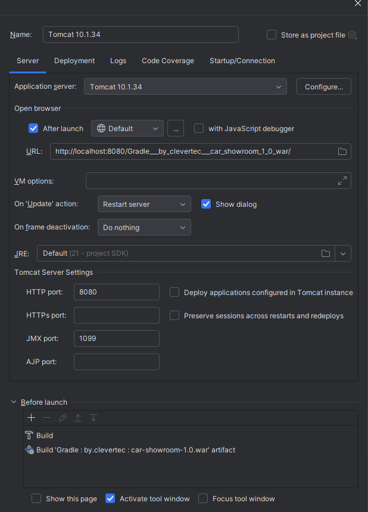

# Spring в проекте "Автосалон"

## Цель задания:
Текущий проект перевести на Spring

## Требования
- Java 21
- Gradle
- Spring
- Spring Data
- Liquibase
- lombok
- mapstruct


### 1. Клонируйте проект на ваш компьютер

### 2. Поднимите контейнер базы данных
База данных поднимается через Docker.
```bash
docker-compose up -d
```
Проверьте, что база данных работает:
```bash
docker ps
```
### 3. Деплой проекта
Задеплойте проект с помощью tomcat


